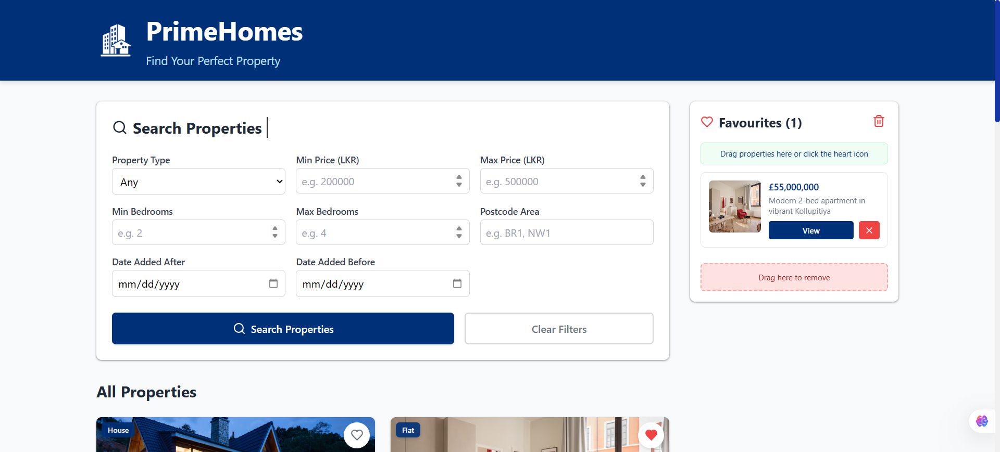
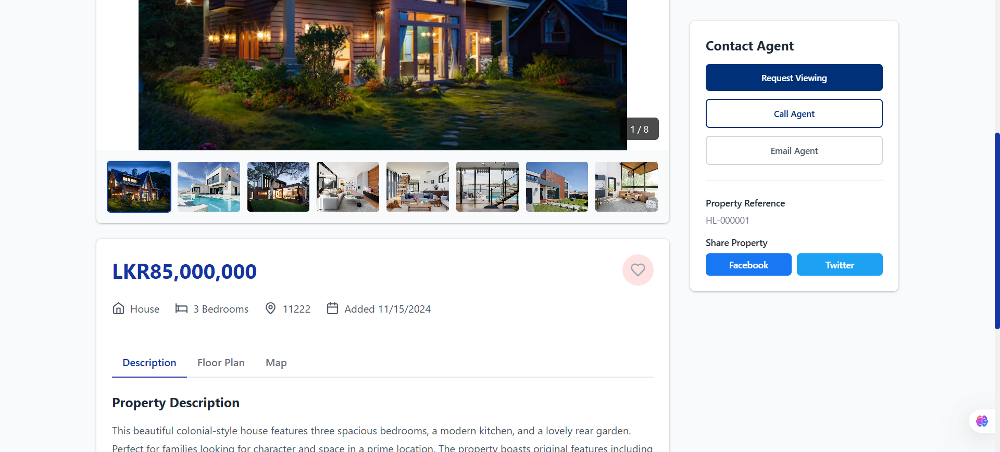

# 🏠 PrimeHomes


**PrimeHomes** is a responsive Client-Side Web Application (SPA) designed to simulate a modern real estate platform. Built with React JS, this application allows users to search for properties, view detailed specifications, and manage a "Favorites" list using interactive drag-and-drop functionality.

This project was developed for the **5COSC026W Advanced Client-Side Web Development** module.

---

## 🔗 Live Demo
🚀 **[View the Deployed Application Here](INSERT_YOUR_DEPLOYED_URL_HERE)**

---

## 📸 Screenshots
| Desktop Search | Property Details | Mobile View |
|:---:|:---:|:---:|
|  |  |  |

---

## ✨ Key Features

### 🔍 Advanced Property Search
Users can filter the JSON dataset of **7 properties** using multiple simultaneous criteria:
* **Type:** House, Flat, or Any.
* **Price:** Minimum and Maximum price ranges.
* **Bedrooms:** Minimum and Maximum bedroom count.
* **Date Added:** Search by specific dates or date ranges.
* **Postcode:** Filter by area code (e.g., BR1, NW1).
* *Powered by React UI Widgets for enhanced consistency and accessibility*.

### 🏡 Property Details & Gallery
* **Dynamic Routing:** Each result links to a dedicated property page.
* **Image Gallery:** Custom implementation allowing users to view a large main image and browse 6-8 thumbnail images.
* **Tabbed Information:** Uses React Tabs to organize the Long Description, Floor Plan, and Google Map integrations.

### ⭐ Interactive Favorites Manager
A robust system to manage saved properties:
* **Drag-and-Drop:** Drag properties directly into the favorites sidebar.
* **Click-to-Save:** "Heart" icon buttons for accessibility.
* **Management:** Remove items by dragging them out or clicking delete. Clear all favorites instantly.
* **Persistency:** The Favorites list is displayed on the main Search Page.

### 📱 Responsive Design
* Fully responsive layout utilizing **CSS Grid** and **Flexbox**.
* Optimized for both Large Screens and Tablet/Mobile (< iPad Landscape).

---

## 🛠️ Technical Implementation

### Tech Stack
* **Frontend Library:** React JS (Create React App).
* **Styling:** Custom CSS with hand-written media queries (No templates used).
* **Data Source:** Local JSON file containing 7 diverse property listings (No server-side database).
* **Testing:** JEST Framework.

### Security Measures 
* **CSP (Content Security Policy):** Implemented to prevent XSS attacks.
* **Sanitization:** HTML encoding ensures protection against injection vulnerabilities.

---

## 🚀 Getting Started

To run this project locally on your machine:

1.  **Clone the repository:**
    ```bash
    git clone [https://github.com/](https://github.com/)[YOUR_USERNAME]/PrimeHomes.git
    ```
2.  **Navigate to the project directory:**
    ```bash
    cd PrimeHomes
    ```
3.  **Install dependencies:**
    *(Note: The `node_modules` folder is excluded from this repo to save space )*
    ```bash
    npm install
    ```
4.  **Run the application:**
    ```bash
    npm start
    ```
    Open [http://localhost:3000](http://localhost:3000) to view it in the browser.

---

## 🧪 Testing

This project includes **5 meaningful tests** covering critical logic using the **JEST** framework.

To run the test suite:
```bash
npm test
